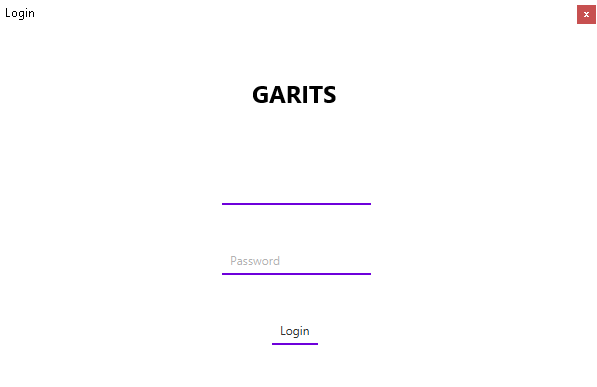
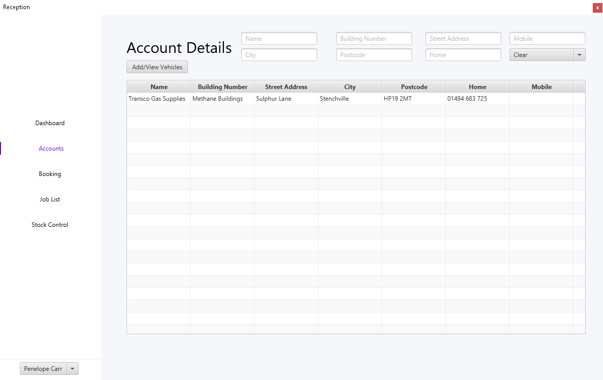
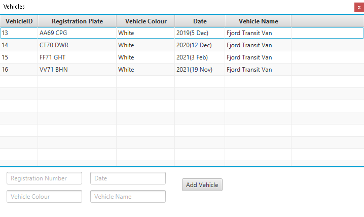
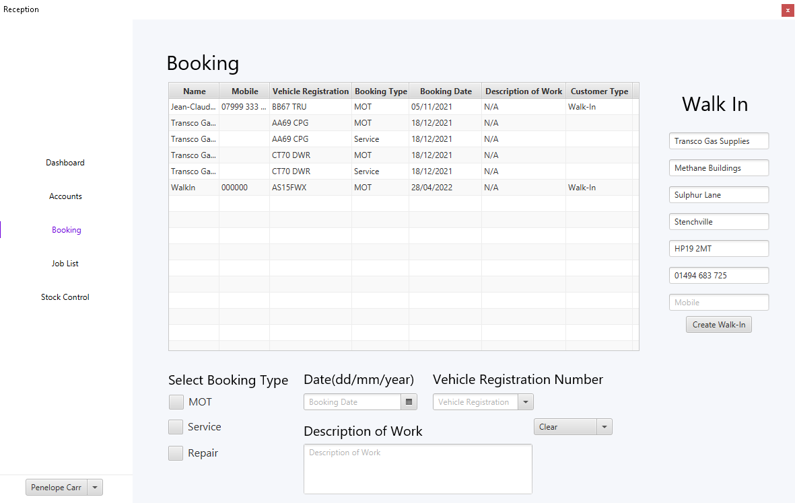
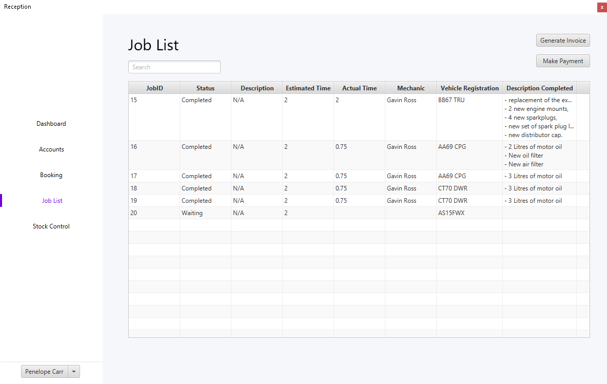
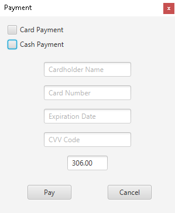
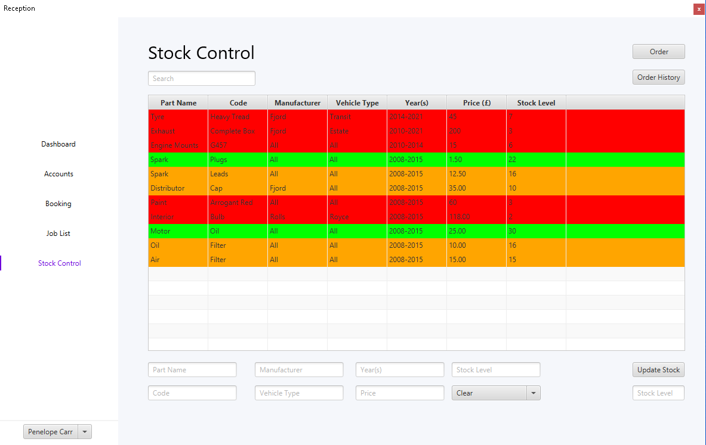
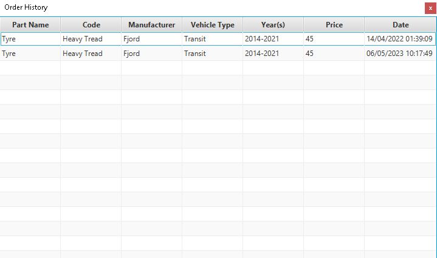

GARTIS System
====
Garage system which allows the user to create a booking or a drop-in. The system helps the mechanics to allocate jobs to customer repairs and maintance bays. Automates the job sheet and the price quote helping the mechanic to focus on prominent things.

Installation
====
Make sure you have the latest [Java SDK](https://www.oracle.com/uk/java/technologies/downloads/) installed.

### Intelij IDEA Instructions
Add all the modules located in the modules folder using the instructions below
````
File -> Project Structure -> Libaries -> +
````

Follow the instructions below in order to add the VM Options
````
Run -> Edit Configurations -> VM Options
````
Copy the line below inside the VM Options to fully allow execution of the application

``
--module-path "src\modules\javafx-sdk-17.0.2\lib" --add-modules javafx.controls,javafx.fxml
``

Login
====
Login that multiple roles in the Garage are able to login such as
* Administrator
* Receptionist
* Franchisee
* Foreman
* Mechanic



Accounts
====
Allows to create a account for a customer with their details and their vehicle details.




### Vehicle Details
Vehicle details allowing the user add multiple cars to one customer




Booking
====
Booking allow the creation of job / what is needed to be done for the customer's vehicle.




Job List
=====
List of jobs that the mechanics has either Completed, Waiting or In-Progress. With the matching vehicle and description of what type of work is needed to be done. Also allows a creation of a invoice and making a payment.




### Payment Screen
This is what the payment screen looks like in order for the customer to pay for the job.




Stock Control
====
Stock Control monitors what parts are in stock and how many are left indicating by the colors Red, Orange and Green which allows the user to differentiate the stock level quickly. The user can order more parts and see the entire order history.



### Order History
List of all the orders that has been ordered to the specific garage.



License
====
[MIT](https://choosealicense.com/licenses/mit/)